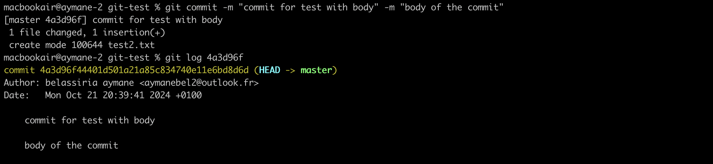
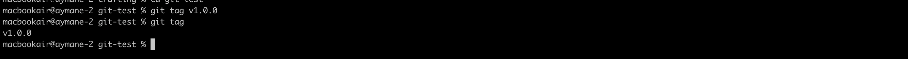
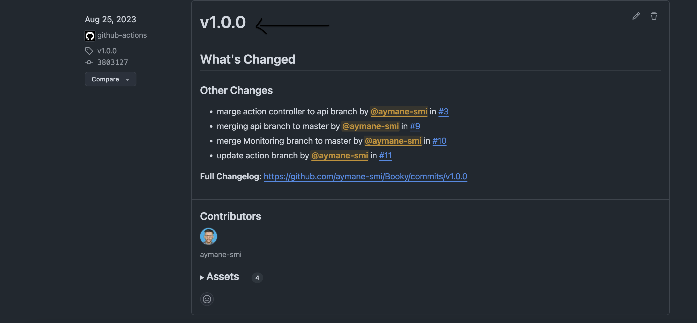

# GIT Workshop for YouCoders
<!-- commit
push
merge
rebase
reset
PR -->

## 1- Introduction

For now, I assume that you know what the Git system is. Before we dive in, I want to give you a quick recap on some basics before moving on:
- Let's start with ```git init```:
git init is a command that will create for us a folder dedicated to Git where the Git magic happens; the folder is called ```.git```.
- After creating the Git repository, we can move to the next important command, which is ```git add```:
git add gives us the possibility to move files from the untracked stage to the tracked stage, or in other words, move files from local to a remote branch. To do this easily, we can use the command ```git add .``` to add all the modified files or ```git add file1 file2...``` to add specific files only.
- After finishing the addition of the wanted files, we use the command ```git commit```: this command gives the possibility to move the added file(s) to a commit. But before this, what is a commit? In general, a commit is a piece of history in our repository where it saves the exact state of the file(s) in order to have some traceability over them. To do so, we can use the whole commit command ```git commit -m "message1" "message2 to add to the body if you want"```.


There is another command for Git commit, ``--amend``; it's up to you to search it 😁.
- Last but not least, the loved command ```git push```. You want to know what it will do, right? Relax, how are you going to transfer your files to your lovely GitHub, GitLab,... repository to showcase, flex on your friends, or whatever? For that, you're going to use ```git push```, not ```git pull```. In general, if you want to push changes on the branch that you are working on, just use ```git push```; if not, you can use ```git push origin_name wanted_branch```.

And voilà, now you have the basics to continue the journey with us👍🏻

Before jumping to the next chapter, please try the lab for [this chapter](./lab-intro)


## 2 - Commit

Congratulations on moving to the next chapter! Now, we will discuss commits in Git and their purpose.

So, what is a commit? In general, a commit is the most important unit in the Git versioning system. With it, we can take a snapshot or picture of the current version of all the staged files in our project. This allows us to track our working project and also roll back to a specific snapshot in case of failure during development.

I guess you now have a quick overview of commits. Let's create some commits then.

### 1 - Adding a Commit Without a Message

What will happen if you enter `git commit` without `-m`? In this case, the CLI will switch to an interactive window (most of the time, Vim) where you must enter a message for the commit.

*To insert, click on `a`, to exit and save, enter `esc` followed by `:wq` and then `enter`.*


### 2 - Oops, I Forgot My File(s)

We've all forgotten to add files to be staged in some cases. To fix this problem, `--amend` is introduced. `--amend` gives you the possibility to add files to the commit.


### 3 - Wait, Let Me Debug the Commits

Sometimes, you want to debug two commits to see the difference between them for some reasons. For that, we use `git diff commit_hash1 commit_hash2`.


*In the example above, you see `HEAD`, which is the last commit. `HEAD~n` means rolling back n steps from the head.*

Before jumping to the next chapter, please try the lab for [this chapter](./lab-commit)


## 3- Push
Now, we are working with one of the most important git commands that you will use, `git push`. This command helps us update a remote reference using local references, in our case **git/github** or **git/gitlab**. It also allows us to create tags and releases.

### 1 - Send it to the Repo

If you are working on a branch called `main` and you have created a commit that you want to send to the final remote repo, you can use `git push origin main`.

### 2 - I'm Lazy, I Hate the Push Command

You may have seen `git push -u` somewhere on GitHub or any other website, but you don't know why. This syntax allows us to use `git push` directly without specifying the origin or the branch. To ensure that it works, we should use `git push origin <origin_name> <branch_name>`, and voila, git will create a reference and use it whenever we hit `git push` or `git pull`.

### 3 - Wait, Can I Push to Multiple Origins 🧐?

Yes, a repo can have multiple origins defined inside it locally. For example, let's create two origins:
`git remote add origin <link>`
`git remote add test <link>`

Now, use `git push <origin|test> <branch_name>`, and voila.

### 4 - Tag, Tags, Tags....

Sometimes, while working with a team or even on an OSS (Open Source Software), we think about using the notion of tag names. Git gives us the possibility to use them in an effective way. First, we create a tag `git tag <tag_name>`, for example, v1.0.0.


Then, we push the tag `git push origin <tag_name>`.


#### 5 - Push One Commit Only

You can push to the remote branch one commit only using the commit hash by typing `git push origin <commit_hash>:<branch_name>`.

Before jumping to the next chapter, please try the lab for [this chapter](./lab-push)